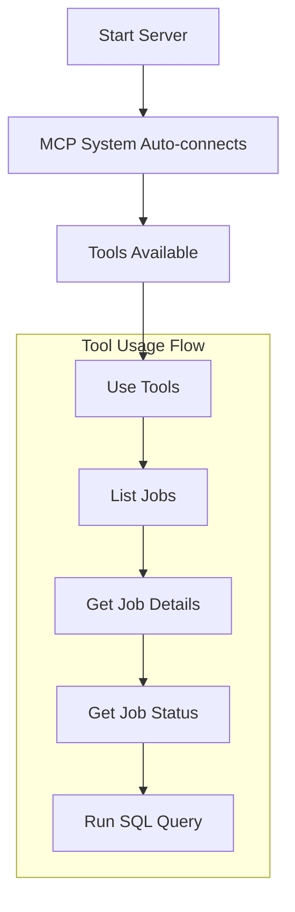

# Databricks MCP Server Tools Guide

This guide outlines the available tools and resources provided by the Databricks MCP server.

## Server Configuration

The server is configured in the MCP settings file with:
```json
{
  "mcpServers": {
    "databricks-server": {
      "command": "python",
      "args": ["main.py"],
      "disabled": false,
      "alwaysAllow": ["list_jobs"],
      "env": {},
      "cwd": "/Users/maheidem/Documents/dev/mcp-databricks-server"
    }
  }
}
```

## Available Tools

### 1. run_sql_query
Execute SQL queries on Databricks SQL warehouse.

**Parameters:**
- sql (string): SQL query to execute

**Example:**
```python
<use_mcp_tool>
<server_name>databricks-server</server_name>
<tool_name>run_sql_query</tool_name>
<arguments>
{
    "sql": "SELECT * FROM my_database.my_table LIMIT 10"
}
</arguments>
</use_mcp_tool>
```

**Returns:** Results in markdown table format

### 2. list_jobs
List all Databricks jobs. This tool is in alwaysAllow list.

**Parameters:** None

**Example:**
```python
<use_mcp_tool>
<server_name>databricks-server</server_name>
<tool_name>list_jobs</tool_name>
<arguments>
{}
</arguments>
</use_mcp_tool>
```

**Returns:** Job list in markdown table format with columns:
- Job ID
- Job Name
- Created By

### 3. get_job_status
Get the status of a specific Databricks job.

**Parameters:**
- job_id (integer): ID of the job to get status for

**Example:**
```python
<use_mcp_tool>
<server_name>databricks-server</server_name>
<tool_name>get_job_status</tool_name>
<arguments>
{
    "job_id": 123
}
</arguments>
</use_mcp_tool>
```

**Returns:** Job runs in markdown table format with columns:
- Run ID
- State
- Start Time
- End Time
- Duration

### 4. get_job_details
Get detailed information about a specific Databricks job.

**Parameters:**
- job_id (integer): ID of the job to get details for

**Example:**
```python
<use_mcp_tool>
<server_name>databricks-server</server_name>
<tool_name>get_job_details</tool_name>
<arguments>
{
    "job_id": 123
}
</arguments>
</use_mcp_tool>
```

**Returns:** Detailed job information in markdown format including:
- Job Name
- Job ID
- Created Time
- Creator
- Tasks (if any)

## Available Resources

### schema://tables
Lists available tables in the Databricks SQL warehouse.

**Example:**
```python
<access_mcp_resource>
<server_name>databricks-server</server_name>
<uri>schema://tables</uri>
</access_mcp_resource>
```

**Returns:** List of tables with their database and schema information.

## Usage Flow



## Requirements

The server requires the following environment variables to be set:
- DATABRICKS_TOKEN
- DATABRICKS_HOST
- DATABRICKS_HTTP_PATH

These are already configured in the .env file.